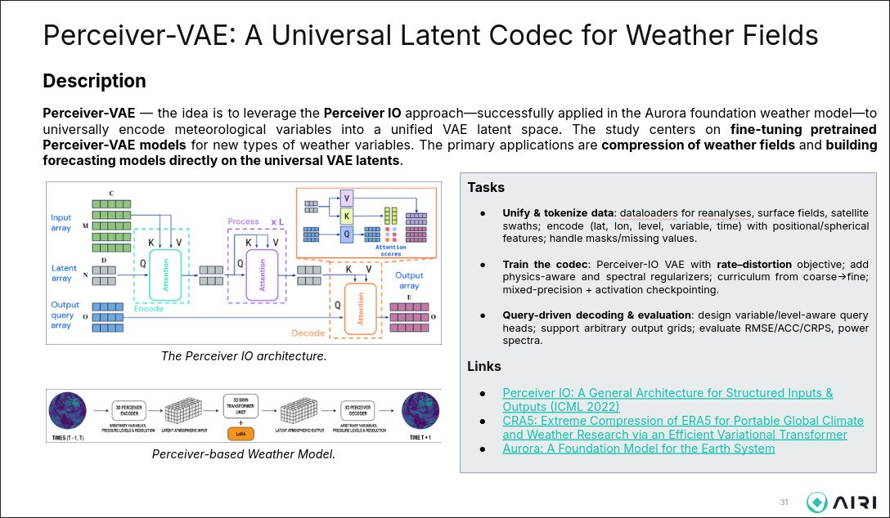

# Сжатие погодных данных - Автокодировщики над ERA5-полями с ограниченной выборкой на обучение
### Команда "ТЧ СЛОН СД"

#### Подготовка, установка зависимостей

``` 
pip install -r requirements.txt
```

#### Архитектура

- ```data/``` - модуль, реализующий работу с датасетами, предобработку данных и оценку статистической информации
- ```models/``` - модель, реализующий модели машинного обучения (энкодер-декодер, латентная модель, энтропийное кодирование)
- ```autoencoder.py``` - реализация обучения и экспорта/импорта весов автоэнкодера
- ```latentmodel.py``` - реализация обучения и экспорта/импорта весов латентной модели
- ```checkpoints/``` - директория, в которой хранятся сохраненные в коде веса моделей
- ```checkpoints/weights/``` - спец.директория для итоговых весов автоэнкодера и латентной модели

#### Итог


- С использованием Google Colab (1 GPU, 12 GB PEAK VRAM) и Kaggle (1 GPU, 15 GB PEAK VRAM) была обучена модель автоэнкодера (по 21000 параметров энкодер и декодер)
- Далее на тех же ресурсах была обучена латентная модель на 26000 параметров